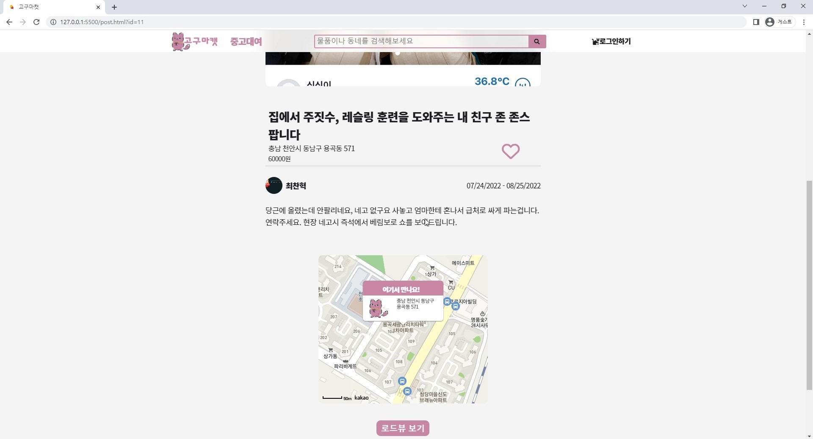

# :sweet_potato: **GogumacatFrontEnd**
**중고물품 대여 플랫폼  
(팀프로젝트) - 프론트엔드** 

 
 
 

>## 1. 제작기간 & 참여인원

 
<li>2022-05-06 ~ 2022-07-29</li>
<li>3명 -> 백엔드 2명 , 프론트엔드 1명 </li>

 
 

>## 2. 사용기술

 
<ul>Front-end
<li>Javascript</li>
<li>jQuery 3.6.0</li>
<li>vue.js</li>
 
</ul>
<ul>Back-end
<li>Java 8 </li>
<li>Spring Boot 2.7.0</li>
<li>Gradle</li>
<li>Spring Data JPA</li>
<li> MySQL </li>
</ul>

 
 

>## 3. 내가 맡은 기능
 

### 3-1. **디자인 적인 부분**
프론트엔드는 눈에 보이는 영역으로서 디자인 적 요소나 순간적으로 확 끌어당길 수 있는 요소가 필요하다 생각했습니다.  
의도는 명확하지만 실력적인 부분이 모자라 주로 유명 사이트들의 디자인을 참고 하였습니다. 
(당근마켓, 라인, 토스 등) 
 

기능 설명 펼치기

*  메인페이지
    - 첫 로딩 화면   :mag: [코드확인](https://github.com/hoinlee-moi/GogumacatFrontEnd/blob/27260c638c3076fb5ff0af5f559f80de97339af2/js/index.js#L98)  
         requestAnimationFrame을 이용하여  첫 페이지가 로딩 될 때 애니메이션 효과를 적용하였습니다. 
         **LINE 홈페이지 참고**  
          
         

          
    - 스크롤 애니메이션   :mag: [코드확인](https://github.com/hoinlee-moi/GogumacatFrontEnd/blob/27260c638c3076fb5ff0af5f559f80de97339af2/js/index.js#L246) 
        addEventListener를 사용하여 사용자가 scroll 할 때마다 값을 갱신하여 특정 세션에 들어올경우  element의 class를 변환하여 CSS의 @Keyframes 의 애니메이션이 동작되도록           만들었습니다. 
        **TOSS 홈페이지 참고** 
         
        

         
    - 인기 리스트 띄우기   :mag: [코드확인](https://github.com/hoinlee-moi/GogumacatFrontEnd/blob/27260c638c3076fb5ff0af5f559f80de97339af2/js/index.js#L342) 
    백엔드에서 보내준 API명세서를 확인하여 jQuery의 Ajax를 이용, 좋아요가 가장 많이 된 인기매물 top8개를 골라 리스트에 띄우도록 만들었습니다. 
    **당근마켓 홈페이지 참고** 
     

     

 
 

### 3-2. **게시판기능**
이 서비스는 사용자가 글을 올림으로서 거래라는 명목이 활성화 됩니다. 
이로인해 다른 누군가가 글을 확인 할 수 있고 그로인해 거래가 완료 되어 글이 수정되거나 삭제되는 등  
게시판 기능이 이 서비스의 핵심이라고 볼 수 있습니다. 
 

기능 설명 펼치기

*   목록페이지   
:mag: [코드확인](https://github.com/hoinlee-moi/GogumacatFrontEnd/blob/72f129fa619388fd739c96c09cd1b6926e2ed8eb/js/list.js#L16) 
    - jQuery의 Ajax를 이용하여 데이터를 받아 전체 목록을 쭉 띄워주도록 하였습니다. 
    - Ajax콜을 할 때 들어가는 값에 따라 최신순과 좋아요 순으로 나뉘도록 하였습니다. 
    - 각 게시글마다 존재하는 id값이 있으며 id값을 도메인에 넣어 상세페이지로 연결합니다 
     
     
     
* 검색기능   
:mag: [코드확인](https://github.com/hoinlee-moi/GogumacatFrontEnd/blob/72f129fa619388fd739c96c09cd1b6926e2ed8eb/js/list.js#L35) 
    - [search.js](https://github.com/hoinlee-moi/GogumacatFrontEnd/blob/7ac7577ea9cccd3fe6d6b67832bf1209dc270f5f/js/search.js#L1) 에 입력된 코드를 통해 검색 값을 도메인에서 받아 Ajax를 사용하여 백엔드에 요청하면 값에 따라 데이터를 받게 됩니다.
    - 받은 데이터 값을 토대로 목록을 띄워줍니다. 
     
     
     
* 글 상세 페이지   
:mag: [코드확인](https://github.com/hoinlee-moi/GogumacatFrontEnd/blob/7ac7577ea9cccd3fe6d6b67832bf1209dc270f5f/js/post.js#L14) 
    - 도메인에서 id값을 받아 Ajax로 백엔드에 요청, 받은 데이터로 상세페이지를 구성합니다.
    - 접속한 유저가 토큰을 가지고 있는지와 게시글에 등록된 username과 접속한 username이 같은지를 비교하여 삭제 수정등의 기능을 비 활성화 합니다. 
      
     
     
     
* 글 작성 페이지   
:mag: [코드확인](https://github.com/hoinlee-moi/GogumacatFrontEnd/blob/3601a0b7c990165f863d2582fade1d508690df68/js/posting.js#L9) 
    -글 작성전에 유저가 로그인을 한 상태인지 쿠키에 저장된 토큰을 확인합니다. 
    -각 입력된 값과 이미지 파일을 FormData에 담아 Ajax로 토큰과 함께 백엔드에 전송합니다. 
     

* 상세 페이지 내 카카오 지도API   
:mag: [코드확인](https://github.com/hoinlee-moi/GogumacatFrontEnd/blob/7ac7577ea9cccd3fe6d6b67832bf1209dc270f5f/js/post.js#L133) 
    - 카카오 api 공식문서를 통하여 지도 api를 구현하였으며 커스텀 오버레이를 통해 고구마캣 대표 색감과 캐릭터 이미지로 변경하였습니다.
    - 버튼을 통하여 지도와 로드뷰를 번갈아 확인할 수 있도록 구현하였습니다. 
      
     
     
     

