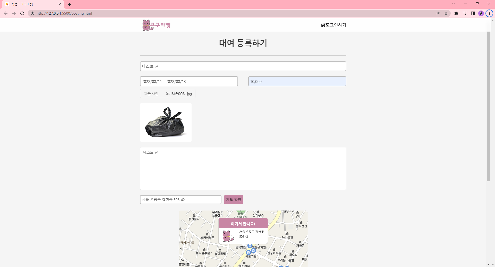

# :sweet_potato: **GogumacatFrontEnd**
<span style="font-size : 19px">**중고물품 대여 플랫폼 <br>
(팀프로젝트) - 프론트엔드**</span> <br>
[팀 github - 프로젝트 관련 commits확인하기](https://github.com/sparta-cloud-a3/GogumaCat-FrontEnd)


<br>
<br>
<br>


>## 1. 제작기간 & 참여인원

<br>
<li>2022-05-06 ~ 2022-07-29</li>
<li>3명 -> 백엔드 2명 , 프론트엔드 1명 </li>

<br>
<br>

>## 2. 사용기술

<br>
<ul><span style="font-size : 18px; font-weight : bold">Front-end</span>
<li>Javascript</li>
<li>jQuery 3.6.0</li>
<li>vue.js</li>
<br>
</ul>
<ul><span style="font-size : 18px; font-weight : bold">Back-end</span>
<li>Java 8 </li>
<li>Spring Boot 2.7.0</li>
<li>Gradle</li>
<li>Spring Data JPA</li>
<li> MySQL </li>
</ul>

<br>
<br>

>## 3. 내가 맡은 기능
<br>

### 3-1. **디자인 적인 부분**
프론트엔드는 눈에 보이는 영역으로서 디자인 적 요소나 순간적으로 확 끌어당길 수 있는 요소가 필요하다 생각했습니다. <br>
의도는 명확하지만 실력적인 부분이 모자라 주로 유명 사이트들의 디자인을 참고 하였습니다.<br>
(당근마켓, 라인, 토스, 애플스토어 등)<br>
<br>
<details>
<summary style="cursor : pointer;">기능 설명 펼치기</summary>

*  <span style="font-size : 15px; font-weight : bold">메인페이지</span>
    - 첫 로딩 화면   :mag: [코드확인](https://github.com/hoinlee-moi/GogumacatFrontEnd/blob/27260c638c3076fb5ff0af5f559f80de97339af2/js/index.js#L98) <br>
         - 코드를 작성하며 이런 인터렉티브 웹을 구성하려면 어떻게 해야하지 라는 고민을 많이했습니다. 코드적으로 이런걸 완성시키는 라이브러리나 함수가 따로 있는건가? 해서 찾던 도중 apple
         사이트와 Line 사이트에서 소스들을 확인<br>
         - 관리자 도구를 이용하여 하나하나 위치를 찾아보며 깨달은 결과 canvas를 이용하여 그림 위에 하얀 화면을 위치시켜 이동하는 방식을 쓰거나 div창의 위치를 옮기는 방식을 확인하였습니다.<br>
         - 그렇게 canvas 효과와 requestAnimationFrame을 이용하여  첫 페이지가 로딩 될 때 애니메이션 효과를 적용하였습니다.<br>
         - 적용 시킬 때 default프레임 속도가 너무 빠르다고 판단 사용자가 페이지를 인식 전에 프레임이 종료 된다거나 너무 빠르기 진행되는 것이 있어 구글링을 통해 setTimeout()이라는 지연 함수를 사용하여 사용자가 너무 지루하거나 빠르다고 느끼지 않을 속도를 구현하였습니다.
         **LINE 홈페이지 참고** <br>
         <br>
         
         

         <br>
    - 스크롤 애니메이션   :mag: [코드확인](https://github.com/hoinlee-moi/GogumacatFrontEnd/blob/27260c638c3076fb5ff0af5f559f80de97339af2/js/index.js#L246)<br>
        - 토스 사이트를 보며 사용자가 봤을 때 부담 없이 느껴지지만 특별함이 있는 듯한 느낌이 들었고 비어있는 곳에서 무언가 나타나면 시선이 그 쪽으로 옮겨지는 사람의 심리를 썼다는 걸 파악하였습니다.<br>
        - 메인페이지의 내용별로 각 section을 나눈 후 각 전체 스크롤과 각 섹션의 높이등을 계산하여 현재 section에서 스크롤이 위치하는 비율을 찾아냈습니다.
        - 이후 switch 문법을 이용 특정 section에서 원하는 스크롤 위치일 때 함수가 실행되도록 만들었지만 함수가 스크롤 위치마다 여러번 실행이 되는 문제가 발생되어 once:true나 removeEventListener까지 사용해보았지만 해결이 안되었습니다.
        - 해결을 위해 스크롤 인터렉티브를 사용하는 TOSS를 다시한번 확인 class명을 이용하여 CSS @keyframs를 적용한다는 걸 발견하였습니다.
        - 이후 addEventListener를 사용하여 사용자가 scroll 할 때마다 값을 갱신하여 특정 세션에 들어올경우<br> element의 class를 변환하여 CSS의 @Keyframes 의 애니메이션이 동작되도록 만들었습니다.<br>
        **TOSS 홈페이지 참고**<br>
        <br>
    
        

        <br>
    - 인기 리스트 띄우기   :mag: [코드확인](https://github.com/hoinlee-moi/GogumacatFrontEnd/blob/27260c638c3076fb5ff0af5f559f80de97339af2/js/index.js#L342)<br>
        - 백엔드에서 보내준 API명세서를 확인하여 jQuery의 Ajax를 이용, 좋아요가 가장 많이 된 인기매물 top8개를 골라 리스트에 띄우도록 만들었습니다.<br>
    **당근마켓 홈페이지 참고**<br>
    <br>

    <br>
</details>

<br>
<br>

### 3-2. **게시판기능**
이 서비스는 사용자가 글을 올림으로서 거래라는 명목이 활성화 됩니다.<br>
이로인해 다른 누군가가 글을 확인 할 수 있고 그로인해 거래가 완료 되어 글이 수정되거나 삭제되는 등 <br>
게시판 기능이 이 서비스의 핵심이라고 볼 수 있습니다.<br>
<br>

<details>
<summary style="cursor : pointer;">기능 설명 펼치기</summary>

*   <span style="font-size : 15px; font-weight : bold">목록페이지</span>   
:mag: [코드확인](https://github.com/hoinlee-moi/GogumacatFrontEnd/blob/72f129fa619388fd739c96c09cd1b6926e2ed8eb/js/list.js#L16)<br>
    - jQuery의 Ajax를 이용하여 데이터를 받아 전체 목록을 쭉 띄워주도록 하였습니다.<br>
    - Ajax콜을 할 때 들어가는 값에 따라 최신순과 좋아요 순으로 나뉘도록 하였습니다.<br>
    - 각 게시글마다 존재하는 id값이 있으며 id값을 URL에 넣어 상세페이지로 연결합니다<br>
    <br>
    <br>
    <br>
* <span style="font-size : 15px; font-weight : bold">검색기능</span>   
:mag: [코드확인](https://github.com/hoinlee-moi/GogumacatFrontEnd/blob/72f129fa619388fd739c96c09cd1b6926e2ed8eb/js/list.js#L35)<br>
    - [search.js](https://github.com/hoinlee-moi/GogumacatFrontEnd/blob/7ac7577ea9cccd3fe6d6b67832bf1209dc270f5f/js/search.js#L1) 에 입력된 코드를 통해 검색 값을 받아 도메인에 넣어줍니다.
    - URL에서 데이터 값을 꺼내 Ajax로 백엔드에 요청 받은 데이터 목록을 띄워줍니다.<br>
    - 검색을 했을 때 어떻게 값을 받아야 하나를 고민했는데 팀원과 튜터님의 도움으로 URL에서 값을 받아오는 방법을 확인하였습니다.<br>
    <br>
    <br>
    <br>
* <span style="font-size : 15px; font-weight : bold">글 상세 페이지(글삭제)</span>   
:mag: [코드확인](https://github.com/hoinlee-moi/GogumacatFrontEnd/blob/7ac7577ea9cccd3fe6d6b67832bf1209dc270f5f/js/post.js#L14)<br>
    - 각 게시글마다 정해진 id값을 있는데 이걸 어떻게 페이지로 연결시켜야 하는지 고민하다 검색기능을 구현할 때 사용한 방식을 이용 
    - URL에서 id값을 받아 Ajax로 백엔드에 요청, 받은 데이터로 상세페이지를 구성하였습니다.
    - 접속한 유저가 토큰을 가지고 있는지와 게시글에 등록된 username과 접속한 username이 같은지를 비교하여 삭제 수정등의 기능을 비 활성화 합니다.<br>
    - 상단의 모든 조건이 통과 될 경우 글 삭제를 누를 시 Ajax로 토큰과 함께 통신을 보내 db상 데이터를 삭제합니다.   
    :mag: [코드확인](https://github.com/hoinlee-moi/GogumacatFrontEnd/blob/424b0ad03085d21146d057612f4545c002182c37/js/post.js#L207)<br>
    <br><br>
    <br>
    <br>
    <br>
* <span style="font-size : 15px; font-weight : bold">글 작성 페이지</span>   
:mag: [코드확인](https://github.com/hoinlee-moi/GogumacatFrontEnd/blob/3601a0b7c990165f863d2582fade1d508690df68/js/posting.js#L9)<br>
    - 글 작성전에 유저가 로그인을 한 상태인지 쿠키에 저장된 토큰을 확인합니다.<br>
    - 날짜 부분에서 jQuery로 이루어진 달력 라이브러리를 사용했습니다   
    :mag: [코드확인](https://github.com/hoinlee-moi/GogumacatFrontEnd/blob/3601a0b7c990165f863d2582fade1d508690df68/js/overlap-posting.js#L107)<br>
    - 지도와 주소부분에서 kakao API공식 문서를 바탕으로 주소 검색과 지도 확인을 구성하였습니다.<br>
    - 등록 버튼을 누를 시 입력된 값과 이미지 파일을 FormData에 담아 Ajax로 토큰과 함께 백엔드에 전송합니다.   
    :mag: [코드확인](https://github.com/hoinlee-moi/GogumacatFrontEnd/blob/3601a0b7c990165f863d2582fade1d508690df68/js/overlap-posting.js#L36)
    <br>
    - 전체적인 구성을 하는 건 간단하였으나 마지막 FormData를 이용하여 Ajax콜을 하는 것은 처음이라 오류가 있었습니다.(백엔드에 데이터가 도착하지 않음)
    - 하나씩 FormData 어떤 데이터가 담기는지 console.log로 찍어 input파일이 담기지 않는 것을 확인했습니다.
    - file의 데이터를 제대로 추출하지 못해서 생긴 문제로 document 쿼리를 이용하여 콘솔창으로 파일이 담기는 형태를 파악하여 추적해서 담았더니 해결하였습니다.
    <br>
    <br>
    <br>
* <span style="font-size : 15px; font-weight : bold">글 수정 페이지</span>   
:mag: [코드확인](https://github.com/hoinlee-moi/GogumacatFrontEnd/blob/424b0ad03085d21146d057612f4545c002182c37/js/posting-update.js#L39)<br>
    - 글 수정 페이지 들어오기 전 url을 통한 우회 접속을 막기 위해 토큰 검사 및 로그인 한 유저와 글 작성 유저가 동일한지 확인합니다.   
    :mag: [코드확인](https://github.com/hoinlee-moi/GogumacatFrontEnd/blob/424b0ad03085d21146d057612f4545c002182c37/js/posting-update.js#L133)<br>
    - url을 통해 id 값을 뽑아 내어 해당하는 게시글의 데이터를 Ajax로 불러와 각 요소에 삽입합니다.<br>
    - 수정 완료 버튼을 누를 시 각 요소의 유무를 파악 후 Ajax를 통해 해당 게시글 데이터를 업데이트 합니다<br>
    - 이 때 무응답 오류가 생겼었는데 이는 파일이 변경되지 않을시 생기는 오류였습니다.
    - 글을 등록할 때 파일 그자체를 s3 버킷에 추가, 버킷에 저장된 URL만 가져와 이미지를 띄워주기 때문에 실제로 수정페이지엔 file 자체가 들어가지 않는 것을 확인
    - 글 등록할 때 추출했던 코드를 이용하여 if문으로 파일 유무를 걸러 FormData에 담고 백엔드 보내주도록 하였습니다.
    - 이는 백엔드에서도 파일 유무를 확인하여 update되도록 팀원과 함께 동시에 수정을 진행하였습니다.
    <br>
    <br>
    <br>
</details>
<br>
<br>

### 3-3. **Open API 사용**
사이트의 기능을 구현하는데 있어 필요한 부분들을 Open API를 이용하여 구현하였습니다.<br>
<br>
<details>
<summary style="cursor : pointer;">기능 설명 펼치기</summary>

* <span style="font-size : 15px; font-weight : bold">상세 페이지 내 카카오 지도API</span>   
:mag: [코드확인](https://github.com/hoinlee-moi/GogumacatFrontEnd/blob/7ac7577ea9cccd3fe6d6b67832bf1209dc270f5f/js/post.js#L133)<br>
    - kakao api 공식문서를 통하여 지도 api를 구현하였으며 커스텀 오버레이를 통해 고구마캣 대표 색감과 캐릭터 이미지로 변경하였습니다.
    - 버튼을 통하여 지도와 로드뷰를 번갈아 확인할 수 있도록 구현하였습니다.<br>
    - 카카오 api를 사용하기 위해 주어진 앱 키의 보안상의 문제가 고민되었습니다
    - 앱 키를 추출하여도 카카오 api페이지 내에서 플랫폼을 등록을 통해 더블체킹으로 사용이 불가능한 것을 확인하였지만 추후 보안 강화를 위해 주기적인 앱키 변경 필요(카카오 dev talk 검색)
     

    <br><br>
    <br>
    <br>
    <br>
* <span style="font-size : 15px; font-weight : bold">주소 검색 API</span>  
:mag: [코드확인](https://github.com/hoinlee-moi/GogumacatFrontEnd/blob/7ac7577ea9cccd3fe6d6b67832bf1209dc270f5f/js/overlap-posting.js#L90)<br>
    - kakao(daum)우편번호 api를 이용하여 구현하였으며 공식문서를 통해 어떤 주소를 입력해도 지번 주소로 출력 되도록 변경하였습니다<br>
    - api구현할 때 지번 주소로만 출력이 되도록 설정하기로 팀원 회의가 결정이 났습니다.
    - api 사용이 익숙하지 않아 어떻게 해야 할까를 고민하다 daum에서 api와 함께 주어지는 공식문서를 활용하여 기능들을 하나씩 대입해 보았습니다.
    - 그리고 구글링과 이미 api를 사용해 본 팀원에게 도움을 요청하여 원하는 결과값이 도출되도록 성공하였습니다.
    <br><br>
    <br>
    <br>
</details>
<br>

### 3-4. **AWS와 git actions를 통한 배포 자동화**
프론트와 백을 분리하여 진행하면서 Git과 AWS의 s3, cloudfront를 이용하여 배포 하였고 git actions를 이용하여 배포 자동화까지 구현하였습니다.
이후 gabia에서 도메인을 구입하여 aws의 cloudfront에 연결, 도메인 변경까지 완료하였습니다.
<br>
<br>
<br>

>## 4. **트러블 슈팅**
<br>

<span style="font-size : 20px; font-weight : bold">핵심 트러블 슈팅</span>
<br>

<span style="font-size : 15px; font-weight : bold">4-1.프론트와 백 분리 </span>
<details>
<summary style="cursor : pointer;">4-1. 트러블 슈팅 펼치기</summary>

* 처음 프로젝트를 시작할 땐 제가 프론트로 전향 전이라 프론트 인원 자체가 없었습니다
* 기존 프로젝트는 python의 flask로 서버를 구성하여 만들었습니다. 이때는 SSR로 구성하였는데 Java로 개발 언어를 바꾸는 과정에서 프론트도 함께 변경해야하는 것과 백엔드에서 생기는 버그에도 프론트 코드까지 재빌드 되는 불편함을 느껴 분리하는 작업을 진행하였습니다.<br>
<br>
    - 이 과정에서 프론트는 사용하였던 템플릿 언어(timeleaf)를 전부 제거 하였습니다.<br>
    - 새롭게 페이지를 구성하며 css가 충돌되는 현상이 있었습니다
    - 크롬 개발자 도구를 사용하여 각 html요소들이 가지는 CSS를 확인해보니 부트스트랩과 bulma라는 css라이브러리들을 사용할 때 가지는 default값이 문제라고 판단, 삭제후 직접 html과 css를 구현하였습니다.<br>
    - 템플릿 언어를 사용하며 html내에서 javascript나 CSS들을 혼합하여 사용되는 중입니다.<br>
    - 이는 정보와 제어 분리가 안되므로 javascript와 CSS를 파일로 분리 하여 중복되는 js코드들이 재활용 할 수 있었으며 캐쉬를 통해 속도 향상, 전송량의 경량화를 도모할 수 있었습니다.
    - 백과 분리되어 끊어진 통신을 api명세서를 바탕으로 jQuery(Ajax)를 이용하여 데이터 통신을 완료 했습니다.<br>
    <br>

* **수정전코드**<br>

    ``` html
    <div class=content-name;>
        <h1 th:text="${post.title}">글제목</h1>
        <h4 th:text="${post.price} +'원 (1일 기준)'">0원 (1일 기준)</h4>
        <h5 th:text="${post.date}">작성 일자</h5>
    </div>
    <div class="content-info" style="white-space: pre-line">
        <br>
        <p th:text="${post.content}">게시물 내용</p>
    </div>
    ```
    <br>

* **수정후코드 - javascript로 데이터를 받아 각 element값을 채워줬습니다.**<br>
    ```html
    <div class="post-img-container">
            <div class="post-img" id="post-img-box">
                
            </div>
        </div>
        <div id="chat-box">
        </div>
        <div class="post-title-container">
            <div class="post-title">
                <p id="postTitle"></p>
                <p id="postAddress"></p>
                <p id="postPrice"></p>
                <p id="postSold"></p>
    ```
    ```javascript
    function getDetail(postId) { 
        $.ajax({
            type: "GET",
            url: `${domain}/post/detail/${postId}`,
            data: {},
            dataType : "json",
            beforeSend: function(xhr) {
                xhr.setRequestHeader("token", token);
            },
            success: function (response) {
                write_user = response['post']['writeUserId']
                makeDetail(response)
            },
            error:() => {
                alert('잘못된 접근입니다.')
                window.history.back()
            }
        })
    };
    ```

</details>
<br>

<span style="font-size : 15px; font-weight : bold">4-2. 유저 보안 </span>
<details>
<summary style="cursor : pointer;">4-2. 트러블 슈팅 펼치기</summary>

* 프로젝트 완성이후 고객 피드백을 받는 과정에서 url을 변경을 통한 접속시 토큰이나 유저에 상관없이 접속 되는 경우가 발생하였습니다.<br>
이로인해 로그인 하지 않은 사람 또는 다른 회원이 다른 사람의 글을 마음대로 변경할 수 있었습니다.
    - 이는 수정페이지를 들어오기 전 페이지에서 토큰을 검사할 뿐 url을 통한 페이지 바로 접속일 때 토큰과 유저 검사가 없었기 때문인 걸 발견하였습니다.<br>
    - 로그인에 관한 문제는 Cookie에 저장된 토큰을 jQuery로 불러와 존재하는지 유무로 간단히 검사할 수 있었습니다.<br>
    - 유저에 대해서는 접속한 유저의 id를 가져올 방법을 떠올리다 다른 페이지에서 로그인을 할 경우 상단 배너에 ajax콜로 프로필 데이터를 불러와 닉네임이 추가되는 것을 생각하였습니다.<br>
    - 수정페이지에 들어갈 때도 똑같이 로그인 한 프로필 데이터를 불러와 글 작성자의 id를 비교할 수 있도록 만들었습니다. 또한 페이지 로드시 바로 검사하도록 추가했습니다.<br>
    - 만약 URL의 id값을 비 정상적인 값으로 접근 시 ajax콜을 거부, error 메세지 와 페이지 접근 불가 조치로 해결하였습니다.<br>
    <br>
* **추가된 코드**

```javascript
function token_check() {
    if(!token) {
        alert('로그인이 필요합니다')
        window.history.back()
    }
}

function user_check() {
    connet_id = document.querySelector('.logo-container #loginName-0').textContent
    console.log(connet_id,write_id)
    if(connet_id != write_id) {
        alert('올바르지 않은 접근입니다.')
        window.history.back()
    }
}

window.addEventListener('load',() => {
    token_check()
    parameter()
    post()
})
```
<br>

</details>
<br>

<span style="font-size : 15px; font-weight : bold">4-3. git actions를 이용한 자동배포시 s3내 파일이나 cloudfront의 캐시가 변경되지 않는 문제 </span>
<details>
<summary style="cursor : pointer;">4-3. 트러블 슈팅 펼치기</summary>

* 자동 배포 완료 후 첫 테스트를 진행하니 s3내의 파일중 index를 제외하곤 변경된 내용이 저장되지 않는 문제점을 발견하였습니다.
    - 문제 해결을 위하여 테스트를 진행 할 때 git actions의 동작을 확인하고 올바르게 로드 되면 버킷 내의 파일이 변동 되었는지 확인하는 식으로 순차적으로 위를 올라가던 도중 s3내의 파일들이 변경 되어 있지 않은 것을 확인하였습니다.
    - 이는 git actions가 로드 될 때 통제하는 부분이 main.yml뿐이 없기에 해당 파일의 코드를 확인하여 exclud와 include의 단어 index.html만 되어 있는 부분을 확인하였습니다.
    -  AWS 자동배포를 공부할 때 사용했던 main.yml 코드를 그대로 가지고 온 것이 문제였습니다.
    - 해당된 코드를 주석처리하여 test 해본 후 정상 작동을 확인하여 해당 코드를 삭제 하였습니다.
    (with부분 삭제)<br>
    - 하지만 이후 S3에 새롭게 빌드된 파일들의 ACL이 private으로 바뀌어 페이지 자체가 ACCESS DENIED 되었습니다.
    - 이는 구글링을 통하여 main.yml을 변경하는 것이 아닌 버킷 정책을 통하여 public으로 바꿀 수 있다는 것을 확인, AWS공식문서에서 제공되는 버킷 정책을 통하여 버킷을 public으로 변경하였습니다.
    <br>
* **수정전코드**
```yml
    steps:
      - name: Checkout source code.
        uses: actions/checkout@master

      - name: Upload binary to S3 bucket
        uses: jakejarvis/s3-sync-action@master
        with:
          args: --acl public-read --exclude '*' --include 'index.html'
        env:
          AWS_S3_BUCKET: ${{ secrets.BUCKET_NAME }}
```
<br>

* **수정후코드**
```yml
steps:
      - name: Checkout source code.
        uses: actions/checkout@master
      - name: Upload binary to S3 bucket
        uses: jakejarvis/s3-sync-action@master
        env:
          AWS_S3_BUCKET: ${{ secrets.BUCKET_NAME }}
```
<br>

* 상단의 문제를 해결 한 뒤 S3내에선 코드 변경이 확인 되었지만 cloudfront에선 index파일 또한 캐시 삭제가 되지 않고 처음 배포된 상태 그대로 유지되는 문제점 또한 발견하였습니다.
    - 이는 상단의 문제를 확인하여 S3 버킷 내의 파일 또한 변경되는 것을 확인하였으나 페이지까지 배포되지 않았습니다.
    - 페이지 개발자 도구를 이용하여 네트워크 탭에서 페이지가 로드 될 때 불러오는 js파일의 소스를 확인하여 변경 전 js파일이 남아있음을 확인하였습니다.
    - 튜터님에게 도움을 요청하여 cloudfront는 캐시 리빌딩에 시간이 꽤 소요됨으로 main.yml에서 캐시삭제 관련 내용을 추가해야 한다는 것을 확인했습니다
    - 이는 위와 같은 main.yml 코드문제 였는데 cloudfront 코드 부분에서 캐시 초기화가 입력되어 있지만 PATHS를 /index.html로 지정하여 생긴 문제로 확인하여 /* 전체로 수정하여 해결하였습니다.
    <br>
    <br>
* **수정전코드**
```yml
- name: Invalidate cache CloudFront
        uses: chetan/invalidate-cloudfront-action@master
        env:
          DISTRIBUTION: ${{ secrets.DISTRIBUTION_ID }}
          PATHS: '/index.html'
        continue-on-error: true

```
<br>

* **수정후코드**
```yml
- name: Invalidate cache CloudFront
        uses: chetan/invalidate-cloudfront-action@master
        env:
          DISTRIBUTION: ${{ secrets.DISTRIBUTION_ID }}
          PATHS: '/*'
        continue-on-error: true
```
<br>
</details>
<br>

<span style="font-size : 20px; font-weight : bold"> 트러블 슈팅</span>
<br>

<span style="font-size : 15px; font-weight : bold">4-4. 메인페이지 스크롤 애니메이션 에러 
</span>
<details>
<summary style="cursor : pointer;">4-4. 트러블 슈팅 펼치기</summary>

* 스크롤을 이용한 인터렉션 페이지를 만드는 도중 사용자가 스크롤 할 때마다 계속해서 애니메이션이 재 시작되는 문제를 발견하였습니다.
    - 문제점을 알아보기 위해 함수가 실행될 때마다 console.log를 이용하여 실행 타이밍을 확인 
    - requestAnimationFrame로 구현하였는데 addEventListener()를 스크롤로 하고 함수 실행 제제가 마땅히 들어가 있지 않아 해당 섹션에서 스크롤이 될 때마다 무한 재실행 되는 것을 콘솔로 확인하였습니다.
    - 이에 스크롤 비율, 섹션 나누기 등을 통하여 제제를 테스트 하던 중 클래스 네임 변경을 이용하는 것을 생각했지만 생각보다 부드러운 프레임이 되지 않았습니다.
    - 그래서 requestAnimationFrame로 구현한 부분을 과감히 포기, 같은 기능을 이용하는 토스의 페이지 소스를 확인하던 중 class네임 변경을 통한 css적용으로 애니메이션을 구현하는 것을 확인했습니다.
    - 진행한 코드를 과감히 삭제 후 CSS의 keyframs 애니메이션 효과를 이용 class명 유무를 트리거로 두어 특정 위치에서 스크롤 될 시 한 번만 애니메이션이 실행되도록 변경하였습니다.

</details>
<br>

<span style="font-size : 15px; font-weight : bold">4-5. canvas 이미지 무응답 에러 </span>
<details>
<summary style="cursor : pointer;">4-5. 트러블 슈팅 펼치기</summary>

* 이미지 파일을 canvas로 그릴 때 아직 load되지 않아 페이지 로딩시 에러 없이 흰색 화면만 출력되었다.<br>
<br>
    - 무응답 오류라 console.log를 사용하여 찍어보기도 하였고 네트워크에서 해당 이미지 파일을 불러오는 것인지도 확인했습니다.
    - 이후 HTML에서 test용 img태그에 같은 이미지를 넣어 확인하니 canvas에 이미지가 삽입 되고 img태그를 삭제하니 다시 무응답 오류가 되는 것을 발견했습니다.
    - canvas는 javascript를 통해 이미지가 로드되고 img 태그는 html을 통해 이미지가 로드 되니 이미지가 준비 되기 전에 canvas가 그려져 무응답 흰색 화면만 출력되는 것을 찾아냈습니다.
    - 해당 문제점을 구글링을 통해 이미지가 로드 되고 canvas에 image를 넣어줄 수 있도록 image.onload 사용하여 해결했습니다.
    - 이후 최초 로딩 화면을 구현함으로서 로딩 화면이 끝난 후 canvas가 그려질 수 있도록 함수 위치를 변경하여 image.onload는 제거하였습니다.
</details>
<br>

<span style="font-size : 15px; font-weight : bold">4-6. jquery 에러 </span>
<details>
<summary style="cursor : pointer;">4-6. 트러블 슈팅 펼치기</summary>

* 글 작성과 글 수정 페이지에서 jQuery가 아예 동작하지 않는 오류가 발생하였습니다.<br>
<br>
    - 문제점을 찾기 위해 개발자 도구 창을 이용하여 에러를 확인하였습니다.
    - javascript 코드 내 $ 시작부터 에러를 발생하는 것을 통해 $를 사용하는 jQuery의 문제점으로 파악하였습니다.
    - HTML에 정상적인 jQuery 라이브러리가 스크립트 되어 있는지를 먼저 확인 후 페이지 개발자 도구의 네트워크 탭을 통해 jQuery가 정상 로드되는 것을 확인해 보았습니다.
    - 확인 결과 jQuery가 2번 로드 되는 것을 확인 달력 라이브러리를 가져올 때 생긴 문제로 다른 버전의 jQuery를 2번 로드하여 생겼다고 판단하여 구 버전 로드를 삭제하니 정상 작동하였습니다.

</details>
<br>

<span style="font-size : 15px; font-weight : bold">4-7. UI/UX 디자인 </span>
<details>
<summary style="cursor : pointer;">4-7. 트러블 슈팅 펼치기</summary>

* 초기 디자인은 매우 단조로웠으며 사용자 편의성도 매우 낮았습니다. 이후에 수정된 부분들도 부족한 부분이 많아 계속되는 수정을 거쳤습니다.<br>
<br>
    - 기존 페이지 구성시 bulma와 부트스트랩을 이용하여 가지고 있던 기존 CSS들 때문에 새롭게 추가된 css들과 충돌이 일어났습니다.
    - 해당 요소들을 삭제하고 클레스나 id 등이 직관적이지 않은 부분을 전부 삭제 후 재 구성하였습니다.
    - 그리고 각 페이지 별로 직접 사용하며 불편한 점들을 하나하나 고쳐 나갔습니다. 
    - 엔터키로 검색이 되지 않는 부분, 색감이나 페이지 구성이 한 눈에 들어오지 않는 부분 등
    - 또 list페이지로 돌아올 버튼이 없는 것, 로그인 버튼이 명확하게 주어지지 않아 사용자가 처음 접속 시 로그인 하기 어려운 점, 첫 메인 페이지에서 바로 list들을 보러가려면 상단 배너의 버튼을 클릭해야 하는 등의 사용자 편의에 불편한 부분들을 수정을 통해 완화하였습니다.
</details>
<br>

<span style="font-size : 15px; font-weight : bold">4-8. 추가 수정시 발생되는 에러 </span>
<details>
<summary style="cursor : pointer;">4-8. 트러블 슈팅 펼치기</summary>

* 프로젝트를 처음 시작할 때 필요한 html요소들이나 domain, token등을 따로 상단에 모아두지 않아 수정시마다 전체에서 검색하여 고쳐야 되는 문제가 발생하였습니다.<br>
    - 각 함수마다 변수명을 새로 지정하며 document 퀴리를 이용하여 불러왔었는데 이로인해 중복코드들이 굉장히 많아졌습니다
    - 또한 프론트를 분리하여 재 구성할 때 변경된 요소 id명 클래스 네임에 맞게 재활용 한 javascript 코드들을 변경할 때 하나하나 찾아가며 변경하고 오타나 변경 안된 부분으로 인해 에러가 발생했습니다.
    - 그로인해 새롭게 프론트를 구성할 때 코드를 진행하며 필요한 변수와 html 요소들을 한꺼번에 상단에 모아두어 정리한 뒤 하단부 코드에서 직접적으로 사용하는 것이 아닌 정리한 변수들을 사용하여 적용하였습니다.
    - 이로인해 수정 변경이 있을 시 상단에 코드를 추가한다거나 변경하여 전체 코드를 찾아가며 수정하는 번거로움이 사라졌습니다.<br>
    <br>
* **수정코드**<br>
```javascript
//도메인과 토큰
const domain = "http://www.hongseos.shop"

const token = $.cookie("mytoken")

//파라미터 닮을 배열
const paramArray = [];
let id = 0;
//비교할 유저 아이디
let connet_id;
let write_id;

//각 input 값 변수 지정
const inputInfo = [{
    type : 'input',
    objs : {
        title : document.querySelector('#posting-title'),
        date : document.querySelector('#calendar'),
        price : document.querySelector('#price'),
        content : document.querySelector('#content'),
        address :document.querySelector('#local_address'),
        file : document.querySelector('#img'),
        file_name : document.querySelector('#file-js-example .file-name'),
        file_preview : document.querySelector('#image_preview #img_pre')
    }
}]
const objs = inputInfo[0].objs
```
</details>
<br>

>## 5. 회고 / 느낀점
<br>

* ### **회고**
    - [개인블로그](https://velog.io/@lee_moi/1%EB%B2%88%EC%A7%B8-%ED%94%84%EB%A1%9C%EC%A0%9D%ED%8A%B8-%ED%9A%8C%EA%B3%A0)
<br>

* ### **느낀점**
    - [개인 블로그](https://velog.io/@lee_moi/WIL-15202207025-0731-%EC%B2%AB-%ED%94%84%EB%A1%9C%EC%A0%9D%ED%8A%B8%EC%9D%98-%EB%81%9D)
